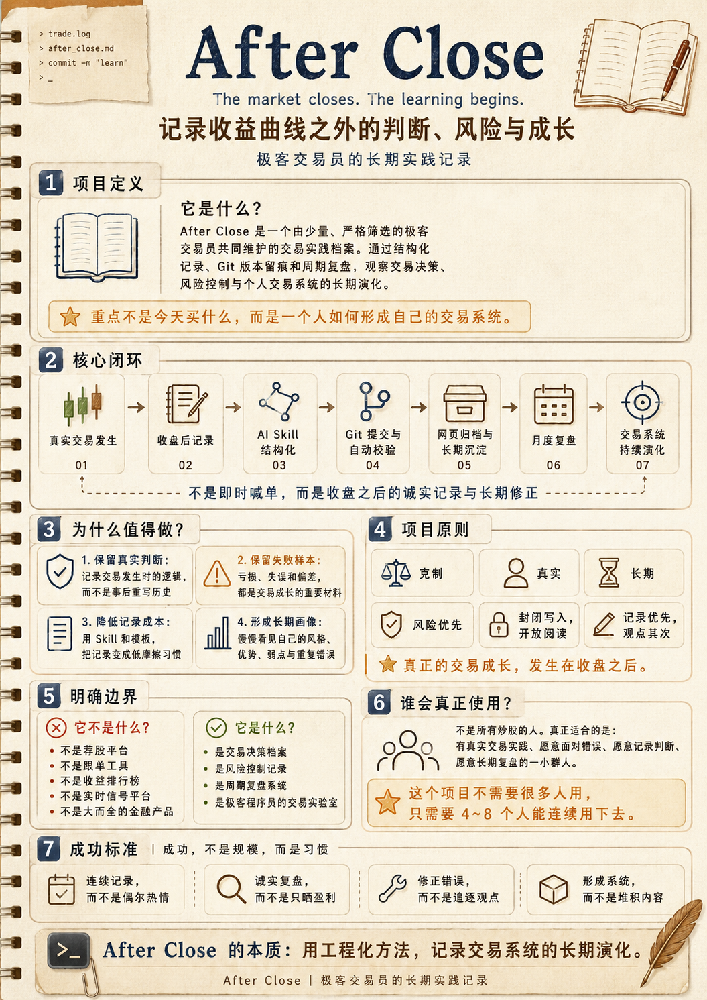

# After Close

> The market closes. The learning begins.



After Close 是一个由少量、严格筛选的极客交易员共同维护的交易实践档案。我们通过结构化记录、Git 版本留痕和周期复盘，保存交易发生当时的判断、风险、执行与修正，并长期观察个人交易系统如何形成和演化。

项目不预测市场，不提供荐股、喊单、跟单、实时仓位或收益承诺，也不以收益排名评价参与者。它不追求人数、活跃度或日更；少量但真实、可复盘的记录比内容规模更重要。

## 当前状态

项目目前处于 **阶段 0：仓库初始化**。

- 已完成：[产品需求文档](spec/AFTER_CLOSE_PRD.md)与开源许可证；
- 正在完成：项目入口文档、宪章、免责声明和基础治理规则；
- 尚未完成：Astro 工程、内容 Schema、脚本、After Close Skill、测试、GitHub Actions 与 Pages 站点；
- 因此，本文后续提到的 `pnpm` 命令和 `pnpm after-close ...` 工作流目前还不能执行，需等对应阶段实现后启用。

完整的产品边界、数据协议、验收标准和建设计划以 [PRD](spec/AFTER_CLOSE_PRD.md) 为准。

## Principles

- Closed contribution, open reading
- Records before opinions
- Risk before return
- Review before conclusion
- No signals, no following, no promises
- Long-term growth over short-term performance

## 项目的长期资产

After Close 的核心不是网站、Pages 或 Skill，而是逐层积累的三类资产：

1. **交易记录**：交易发生时的判断、仓位变化、风险边界、执行、结果与复盘；
2. **交易方法**：从长期记录中识别个人风格、优势、边界、执行偏差和重复错误；
3. **群体知识**：沉淀不同风格、市场环境和风险处理方式下的真实案例。

网站只是阅读窗口，Skill 只是降低记录成本的入口，GitHub 则负责保留可信时间线。即使这些工具未来更换，Markdown、YAML 和 Git 中的历史仍应可读取、可迁移。

## V1 闭环

```text
真实交易发生
    ↓
Agent 协助结构化记录
    ↓
本地校验风险、权限与隐私
    ↓
成员确认内容和 Git Diff
    ↓
分支、Commit 与 Pull Request
    ↓
CI 校验并合并到 main
    ↓
GitHub Pages 自动发布
    ↓
月度复盘与交易系统修正
```

V1 是一个静态、Git 驱动的内容项目：不需要后端、数据库、线上账户系统或独立服务器。

## 技术基线

| 层次 | 方案 |
| --- | --- |
| 内容 | Markdown + YAML Frontmatter |
| 内容模型 | Astro Content Collections + Zod |
| 网站 | Astro 静态站点 |
| 包管理 | pnpm |
| 脚本 | TypeScript / Node.js |
| 测试 | Vitest |
| 内容校验 | Zod + markdownlint + 项目策略脚本 |
| 协作 | Git + GitHub CLI + Pull Request |
| CI/CD | GitHub Actions |
| 部署 | GitHub Pages |
| Agent 工作流 | 单一 `after-close` Skill |

初始化工程时应在仓库中锁定 Node.js 与 pnpm 版本，并提交 lockfile，保证本地、CI 与 Pages 构建环境一致。

## 项目初始化路线

初始化必须按照“规则先于内容、真实案例先于 Schema、校验先于发布、协作先于规模”的顺序进行。先跑通记录闭环，网站视觉放在最后。

| 阶段 | 主要产出 | 完成标准 |
| --- | --- | --- |
| 0. 立项与治理 | `README.md`、`CHARTER.md`、`DISCLAIMER.md`、`GOVERNANCE.md`、`CONTRIBUTING.md`、`SECURITY.md` | 项目定位、参与边界、免责声明和处理规则无歧义 |
| 1. 协议与工程 | 脱敏真实案例、Member/Record/Review Schema、受控标签、Astro/pnpm 工程 | 真实案例可以稳定通过 Schema 并完成静态构建 |
| 2. 脚本与 Skill | `init`、`record`、`validate`、`publish`、`review`、ownership 与敏感信息扫描 | 成员可以通过 Agent 完成一条记录从创建到 PR 的流程 |
| 3. GitHub 协作 | Teams、Ruleset、CODEOWNERS、PR 模板、CI、Auto Merge | 非法路径、无效内容和外部投稿无法进入 `main` |
| 4. 网站与部署 | 首页、记录、Case 时间线、成员、复盘、About、Pages | `main` 中全部合法内容可稳定构建并自动发布 |
| 5. 小范围试运行 | 4～8 名受邀成员、连续 4 周真实记录 | 验证记录成本、风险字段、Case 模型和月度复盘是否可持续 |

### 1. 初始化治理文件

在写业务代码前，先从 PRD 拆分并评审以下文件：

```text
CHARTER.md       项目长期原则与不可突破的边界
DISCLAIMER.md    固定投资风险声明与利益冲突说明
GOVERNANCE.md    角色、准入、退出、修订和争议处理
CONTRIBUTING.md  受邀成员的内容与 PR 流程
SECURITY.md      敏感信息、密钥泄漏和历史清理流程
AGENTS.md        Agent 在仓库内必须遵守的项目级规则
CLAUDE.md        Claude Code 的项目入口与 Skill 指引
```

### 2. 验证内容协议并初始化 Astro

不要从抽象 Schema 开始。先用少量真实、脱敏的交易案例确认：最少需要哪些字段、加减仓如何关联、Case 何时结束、风险如何表达、月度复盘如何引用原始记录。协议稳定后再固化到代码。

这一阶段需要完成：

1. 手工整理覆盖 Open、Increase、Reduce、Close 和月度 Review 的脱敏案例；
2. 确认 Decision Record、Trade Case、Review 与 Amendment 的边界；
3. 创建 Astro TypeScript 项目并配置静态输出；
4. 在 `package.json` 中声明 pnpm 版本，在版本文件中固定 Node.js 版本；
5. 建立 `members`、`records`、`reviews` 三类内容目录；
6. 配置 Astro Content Collections、Zod Schema 和受控标签；
7. 将真实案例转为可测试的 fixtures；
8. 接入格式检查、单元测试和生产构建命令。

目标内容路径：

```text
src/content/members/{trader_id}.yaml
src/content/records/{trader_id}/{YYYY}/{MM}/{date}-{symbol}-{sequence}.md
src/content/reviews/{trader_id}/{YYYY}/{YYYY-MM}.md
```

### 3. 初始化确定性脚本与 Skill

ID、路径、日期、Schema、目录权限、重复记录、敏感信息、Git 分支和 PR 创建必须由脚本处理，不能只依赖模型自由生成。Skill 的价值不只是生成 Markdown，而是把规范化记录、校验和 Git 发布流程隐藏在自然语言交互之后。

单一 `after-close` Skill 提供四个主工作流：

```text
init      初始化受邀成员与本地环境
record    收集信息并生成交易记录草稿
publish   校验、展示 Diff，并在确认后创建 PR
review    汇总记录并生成周期复盘草稿
```

辅助能力包括 `doctor`、`validate` 与 `amend`。Skill 不得推荐标的、决定仓位、生成交易信号，且不得在用户确认前 Push。

### 4. 初始化 GitHub Organization 与仓库规则

推荐组织结构：

```text
after-close-lab
├── @after-close-lab/maintainers  Maintain / Admin
└── @after-close-lab/traders      Write
```

`main` 分支 Ruleset 至少需要：

- 禁止直接 Push、Force Push 和删除分支；
- 所有变更必须经过 Pull Request；
- 要求身份、目录所有权、内容 Schema、内容策略、敏感信息、测试和构建检查通过；
- 使用 Squash Merge，合并后自动删除分支；
- 只有 Maintainer 可以修改核心代码、Schema、Skill、工作流和治理文件；
- 受邀成员只可修改自己的记录与复盘目录；
- 外部 Pull Request 不进入内容站点。

GitHub Pages 选择 **GitHub Actions** 作为构建来源。普通校验工作流保持只读权限，仅部署 Job 开放 `pages: write` 与 `id-token: write`。

Skill 可以公开复用，但公开 Skill 不代表开放加入。仓库写权限、`trader_id`、个人目录和网站作者身份只能由 Maintainer 分配。

## 目标仓库结构

```text
after-close/
├── README.md
├── spec/
│   └── AFTER_CLOSE_PRD.md
├── CHARTER.md
├── DISCLAIMER.md
├── GOVERNANCE.md
├── CONTRIBUTING.md
├── SECURITY.md
├── AGENTS.md
├── CLAUDE.md
├── package.json
├── astro.config.mjs
├── skills/after-close/
├── scripts/
├── src/
│   ├── content.config.ts
│   ├── content/{members,records,reviews}/
│   ├── components/
│   ├── layouts/
│   ├── pages/
│   └── styles/
├── tests/
└── .github/
    ├── CODEOWNERS
    └── workflows/{validate,build,deploy-pages}.yml
```

## 本地开发约定

以下是工程完成阶段 1 后应提供的统一入口；当前仓库尚未实现：

```bash
pnpm install
pnpm dev
pnpm validate
pnpm test
pnpm build
```

所有命令都应能在无全局项目依赖的干净环境中运行。提交前至少执行 `pnpm validate`、`pnpm test` 和 `pnpm build`。

阶段 2 完成后，成员入口应统一为：

```bash
pnpm after-close init
pnpm after-close doctor
```

成员日常记录与发布优先通过自然语言触发 Skill，不要求手工编辑 YAML，也不允许脚本未经确认自动 Push。

## 成员初始化流程（待实现）

1. Owner 审核并邀请成员加入 GitHub Organization；
2. Maintainer 分配不可变的 `trader_id`，建立 GitHub 用户名与目录映射；
3. Maintainer 创建 `src/content/members/{trader_id}.yaml`；
4. 成员 Clone 仓库并完成 `gh auth login`；
5. 执行 `pnpm install`、`pnpm after-close init` 与 `pnpm after-close doctor`；
6. 填写 Coverage Statement，明确记录与不记录的账户、市场和品种；
7. 创建一条测试记录并运行本地校验；
8. 通过 Pull Request 验证身份、目录权限、内容 Schema、隐私扫描和构建流程。

### 本地初始化信息

`init` 工作流需要收集以下本地偏好，并与仓库中由 Maintainer 维护的 Member 身份进行核对：

```yaml
trader_id: liukaining
default_market: US
timezone: Asia/Shanghai
disclosure_mode: percentage
publication_policy: after_close
```

这份本地配置的文件路径将在实现 `init` 时确定，必须加入 `.gitignore`，不得提交到仓库。GitHub 用户名、公开 Coverage Statement 和目录所有权映射仍由仓库中的 Member 配置维护，本地文件不能自行赋予成员身份或写入权限。

成员默认使用 `percentage` 披露模式，并默认在相关市场收盘后发布。盘中可以在本地形成草稿，但不得默认 Push 或公开。

> **公开仓库没有私密内容模式。** 只要文件进入 Git 历史，即使网页不展示或之后删除，也可能继续被读取。不得提交账户总金额、券商账号、订单号、Token、密钥、完整对账单或可反推出完整资产的信息。

## V1 不做什么

- 公开注册、在线投稿和用户账户系统；
- 独立后端、数据库、券商 API 和自动下单；
- 实时行情、盘中信号、提醒、荐股和跟单；
- 收益排行榜、点赞、评论、关注和推荐算法；
- 付费订阅、广告、收益承诺和复杂组合管理。

## 免责声明

After Close 仅用于记录参与者个人在特定时间下的交易实践、判断和复盘，不构成任何投资建议、证券推荐、收益承诺或交易邀约。参与者可能持有文中提及的资产。任何人不应依据本项目内容直接作出投资决策。

## License

项目代码以 [MIT License](LICENSE) 发布。交易记录与其他内容的授权边界将在正式开放内容前于治理文件中单独明确。
